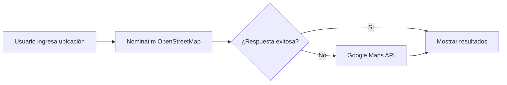
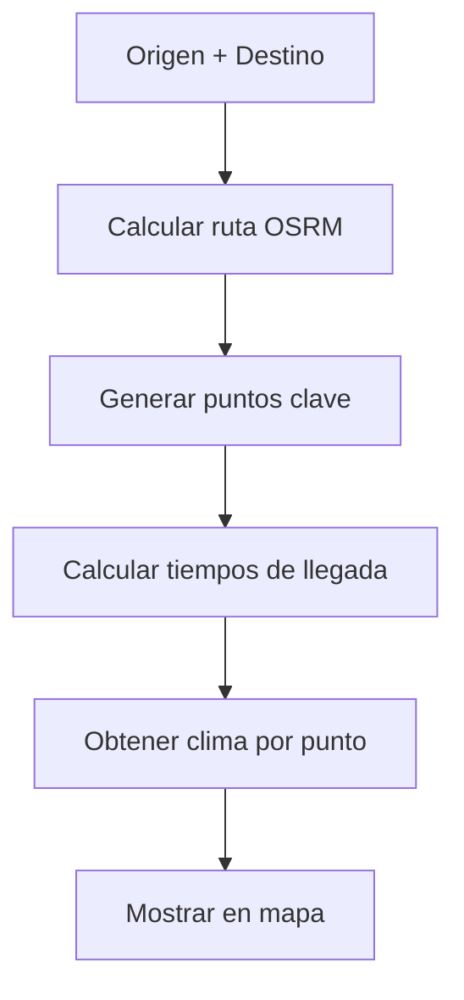

# 🌤️ AURA - Asistente de Ubicación y Ruta Atmosférica

<div align="center">
  
  
  
  
</div>

<br />

<div align="center">
  <h3>🎯 Planifica tu viaje con inteligencia meteorológica</h3>
  <p>Una aplicación web avanzada que combina navegación inteligente con pronósticos meteorológicos en tiempo real para optimizar tus rutas de viaje.</p>
</div>

---

## ✨ Características Principales

### 🎯 **Análisis Geo-Temporal Inteligente**
- Calcula el clima preciso en cada punto de tu ruta según el tiempo de llegada
- Optimización automática de puntos meteorológicos clave
- Predicciones meteorológicas específicas por ubicación y hora

### 🗺️ **Mapas Interactivos Avanzados**
- Visualización en tiempo real con **Leaflet.js**
- Marcadores meteorológicos dinámicos y personalizables
- Navegación fluida con zoom inteligente según la distancia de ruta
- Centrado automático en origen con botón de retorno rápido

### 🌐 **Integración Multi-API Robusta**
- **Google Maps API** para direcciones precisas
- **OpenWeather API** para datos meteorológicos confiables
- **Nominatim (OpenStreetMap)** como sistema de respaldo
- Sistema de fallback automático entre servicios

### 🎨 **Interfaz Moderna y Responsive**
- Diseño **Glass Morphism** con efectos de transparencia
- Layout optimizado: sidebar compacto (25%) + mapa protagonista (75%)
- Totalmente responsive para desktop, tablet y móvil
- Animaciones suaves y transiciones elegantes

### 🔍 **Búsqueda Geográfica Limitada**
- Enfoque específico en **Sudamérica** para resultados relevantes
- Autocompletado inteligente con geocoding dual
- Validación automática de ubicaciones

---

## 🚀 Demo en Vivo

🔗 **[Ver Demo](https://aur-a.netlify.app)** | 📖 **[Documentación](https://github.com/Julian-Enable/AURA)**

---

## �️ Stack Tecnológico

| Categoría | Tecnología | Versión | Propósito |
|-----------|------------|---------|-----------|
| **Frontend** | React | 18.x | Interfaz de usuario reactiva |
| **Lenguaje** | TypeScript | 5.x | Tipado estático y robustez |
| **Build Tool** | Vite | 5.x | Desarrollo ultrarrápido |
| **Estilos** | Tailwind CSS | 3.4.x | Diseño utilitario moderno |
| **Mapas** | Leaflet.js | 1.9.x | Mapas interactivos ligeros |
| **HTTP** | Fetch API | Nativo | Comunicación con APIs |
| **Iconos** | Lucide React | 0.x | Iconografía consistente |

---

## � Configuración Rápida

### ⚡ Instalación Automática

```bash
# Clona el repositorio
git clone https://github.com/Julian-Enable/AURA.git
cd AURA

# Instala dependencias
npm install

# Configuración de entorno
cp .env.example .env.local

# Inicia el servidor de desarrollo
npm run dev
```

### 🔑 Variables de Entorno

Crea un archivo `.env.local` con tus API keys:

```env
# APIs Principales
VITE_GOOGLE_MAPS_API_KEY=tu_google_maps_api_key_aquí
VITE_OPENWEATHER_API_KEY=tu_openweather_api_key_aquí

# Configuración (Opcional)
VITE_WEATHER_UNITS=metric
```

---

## � Obtención de API Keys

### 🗺️ Google Maps Platform

1. **Accede a [Google Cloud Console](https://console.cloud.google.com/)**
2. **Crear/Seleccionar proyecto**
3. **Habilitar APIs necesarias:**
   - Places API (Text Search)
   - Geocoding API
4. **Generar API Key** en "Credenciales"
5. **Configurar restricciones** (por dominio/IP)

**💡 Nota:** Plan gratuito incluye $200/mes en créditos

### 🌤️ OpenWeather API

1. **Regístrate en [OpenWeather](https://openweathermap.org/api)**
2. **Obtén tu API Key** gratuita
3. **Plan gratuito:** 1,000 llamadas/día, 60 llamadas/minuto

---

## 🏗️ Arquitectura del Proyecto

```
AURA/
├── 📁 src/
│   ├── 📁 components/          # Componentes React modulares
│   │   ├── 🎯 RouteForm.tsx         # Formulario de búsqueda
│   │   ├── 🗺️ WeatherMap.tsx        # Mapa interactivo
│   │   ├── 📊 RouteDetails.tsx      # Panel de detalles
│   │   └── 🔍 AutocompleteInput.tsx # Entrada con autocompletado
│   ├── 📁 services/            # Lógica de negocio
│   │   ├── 🌐 api.ts               # Cliente OpenWeather
│   │   └── 📍 places.ts            # Servicios de geocoding
│   ├── 📁 types/               # Definiciones TypeScript
│   │   └── 📝 index.ts             # Interfaces principales
│   ├── 📁 config/              # Configuración
│   │   └── ⚙️ env.ts               # Variables de entorno
│   ├── 📁 utils/               # Utilidades
│   │   └── 🧪 mockData.ts          # Datos de prueba
│   ├── 🎨 App.tsx              # Componente principal
│   ├── 🚀 main.tsx             # Punto de entrada
│   └── 💄 index.css            # Estilos globales
├── 📁 public/                  # Archivos estáticos
├── ⚙️ package.json             # Dependencias del proyecto
├── 🎨 tailwind.config.js       # Configuración de Tailwind
├── ⚡ vite.config.ts           # Configuración de Vite
└── 📖 README.md                # Documentación
```

---

## � Flujo de Funcionamiento

### 1️⃣ **Búsqueda de Ubicaciones**


### 2️⃣ **Cálculo de Ruta y Clima**


### 3️⃣ **Visualización Inteligente**
- **Auto-centrado** en origen al seleccionar
- **Zoom adaptativo** según distancia de ruta
- **Marcadores dinámicos** con información meteorológica
- **Persistencia de vista** durante análisis

---

## 🎨 Personalización Avanzada

### 🎨 **Tema Visual**

```css
/* Gradiente principal personalizable */
.aura-gradient {
  background: linear-gradient(135deg, 
    #1e40af 0%, 
    #3b82f6 25%, 
    #0ea5e9 75%, 
    #06b6d4 100%
  );
}

/* Efectos Glass Morphism */
.weather-card {
  backdrop-filter: blur(10px);
  background: rgba(255, 255, 255, 0.95);
}
```

### 🌤️ **Iconos Meteorológicos**

Personaliza los iconos del clima en `src/services/api.ts`:

```typescript
export function getWeatherIcon(icon: string): string {
  const iconMap: Record<string, string> = {
    '01d': '☀️',  // Sol
    '01n': '🌙',  // Luna
    '02d': '⛅',  // Parcialmente nublado
    '09d': '🌧️',  // Lluvia
    '13d': '❄️',  // Nieve
    // ... personalizar más iconos
  };
  return iconMap[icon] || '🌤️';
}
```

---

## 🚀 Despliegue en Producción

### 🌐 **Netlify (Recomendado)**

```bash
# Build para producción
npm run build

# Deploy automático con Netlify CLI
npx netlify deploy --prod --dir=dist
```

**Variables de entorno en Netlify:**
- `VITE_GOOGLE_MAPS_API_KEY`
- `VITE_OPENWEATHER_API_KEY`

### ⚡ **Vercel**

```bash
# Deploy con Vercel CLI
npx vercel --prod
```

### 🐳 **Docker**

```dockerfile
FROM node:18-alpine
WORKDIR /app
COPY package*.json ./
RUN npm ci --only=production
COPY . .
RUN npm run build
EXPOSE 3000
CMD ["npm", "run", "preview"]
```

---

## 🧪 Scripts Disponibles

| Comando | Descripción | Uso |
|---------|-------------|-----|
| `npm run dev` | Servidor de desarrollo | Desarrollo local |
| `npm run build` | Build para producción | Antes del deploy |
| `npm run preview` | Previsualizar build | Testing pre-deploy |
| `npm run lint` | Linter TypeScript | Verificar código |
| `npm run type-check` | Verificar tipos | CI/CD |

---

## � Configuración Avanzada

### 🌍 **Configuración Regional**

```typescript
// src/config/env.ts
export const config = {
  // Unidades meteorológicas
  WEATHER_UNITS: 'metric', // metric, imperial, kelvin
  
  // Región de búsqueda (Sudamérica)
  SEARCH_BOUNDS: {
    north: 13.4,
    south: -56.0,
    east: -34.8,
    west: -81.2
  },
  
  // Idioma de la aplicación
  LANGUAGE: 'es',
  REGION: 'co' // Colombia como base
};
```

### 📊 **Límites de APIs**

| API | Plan Gratuito | Límite | Costo Adicional |
|-----|---------------|--------|-----------------|
| OpenWeather | 1,000/día | 60/min | $1.5/10k calls |
| Google Maps | $200 crédito | Variable | $5/1k requests |
| Nominatim | Ilimitado | 1/seg | Donaciones |

---

## 🤝 Contribución

### 🚀 **Cómo Contribuir**

1. **Fork** el repositorio
2. **Crea** una rama feature (`git checkout -b feature/nueva-funcionalidad`)
3. **Commit** tus cambios (`git commit -am 'Agrega nueva funcionalidad'`)
4. **Push** a la rama (`git push origin feature/nueva-funcionalidad`)
5. **Abre** un Pull Request

### 📝 **Convención de Commits**

```bash
feat: añade nueva funcionalidad
fix: corrige bug
docs: actualiza documentación
style: cambios de formato
refactor: refactorización de código
test: añade tests
chore: mantenimiento
```

### 🐛 **Reporte de Bugs**

Usa el [template de issues](https://github.com/Julian-Enable/AURA/issues/new) con:
- ✅ Descripción del problema
- ✅ Pasos para reproducir
- ✅ Comportamiento esperado
- ✅ Screenshots (si aplica)
- ✅ Información del navegador

---

## 📈 Roadmap

### 🎯 **Próximas Funcionalidades**

- [ ] 🚗 **Múltiples medios de transporte** (auto, bicicleta, caminata)
- [ ] 📱 **App móvil nativa** (React Native)
- [ ] 🤖 **IA predictiva** para sugerencias de rutas
- [ ] 🌡️ **Alertas meteorológicas** en tiempo real
- [ ] 📊 **Histórico de viajes** y estadísticas
- [ ] 🔄 **Rutas alternativas** según condiciones climáticas
- [ ] 🌐 **Modo offline** con cache inteligente
- [ ] 👥 **Colaboración** en rutas grupales

### 🏆 **Versiones**

- **v1.0** ✅ - Core functionality
- **v1.1** ✅ - UI/UX improvements
- **v1.2** 🚧 - Performance optimization
- **v2.0** 📅 - Mobile app & AI features

---

## 📊 Métricas y Rendimiento

### ⚡ **Performance**

- **Tiempo de carga inicial:** < 2s
- **Tiempo de respuesta API:** < 500ms
- **Lighthouse Score:** 95+ (Performance)
- **Bundle size:** < 500KB (gzipped)

### 📈 **Compatibilidad**

| Navegador | Versión Mínima | Soporte |
|-----------|----------------|---------|
| Chrome | 88+ | ✅ Completo |
| Firefox | 85+ | ✅ Completo |
| Safari | 14+ | ✅ Completo |
| Edge | 88+ | ✅ Completo |

---

## 🙏 Agradecimientos

### 🌟 **APIs y Servicios**
- [🗺️ Google Maps Platform](https://developers.google.com/maps) - Direcciones precisas
- [🌤️ OpenWeather](https://openweathermap.org/) - Datos meteorológicos
- [🌍 OpenStreetMap](https://www.openstreetmap.org/) - Geocoding abierto
- [🚗 OSRM](http://project-osrm.org/) - Enrutamiento optimizado

### 🛠️ **Tecnologías**
- [⚛️ React Team](https://react.dev/) - Framework increíble
- [🎨 Tailwind Labs](https://tailwindcss.com/) - Estilos utilitarios
- [🍃 Leaflet](https://leafletjs.com/) - Mapas ligeros
- [⚡ Vite Team](https://vitejs.dev/) - Build tool ultrarrápido

---

## 📝 Licencia

Este proyecto está licenciado bajo la **MIT License** - ver el archivo [LICENSE](LICENSE) para detalles.

```
MIT License - Libre para uso comercial y personal
```

---

## 📞 Soporte y Contacto

### 💬 **Canales de Soporte**

- 🐛 **Issues:** [GitHub Issues](https://github.com/Julian-Enable/AURA/issues)
- 💬 **Discusiones:** [GitHub Discussions](https://github.com/Julian-Enable/AURA/discussions)
- 📧 **Email:** engjuliangonzalez@gmail.com

### 🆘 **Problemas Comunes**

| Problema | Solución |
|----------|----------|
| API Keys no funcionan | Verificar restricciones de dominio |
| Mapa no carga | Comprobar conexión y CORS |
| Resultados incorrectos | Validar formato de ubicaciones |
| Performance lenta | Usar build de producción |

---

<div align="center">
  <h3>🌟 ¿Te gusta AURA? ¡Dale una estrella! ⭐</h3>
  <p>
    <a href="https://github.com/Julian-Enable/AURA/stargazers">
      
    </a>
    <a href="https://github.com/Julian-Enable/AURA/network/members">
      
    </a>
  </p>
  
  <p><strong>Desarrollado con ❤️ por <a href="https://github.com/Julian-Enable">Julian Enable</a></strong></p>
  
  <p>
    <em>🌤️ Planifica tu próximo viaje con inteligencia atmosférica 🗺️</em>
  </p>
</div>
